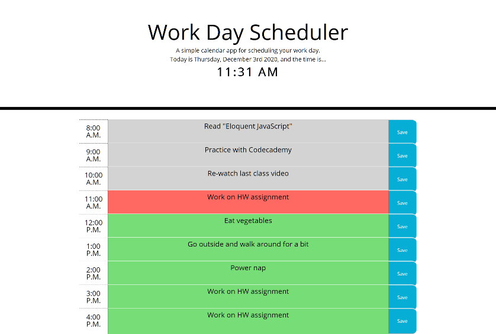

## Work Day Scheduler

## Description 

This is a simple calendar application that allows a user to save events for each hour of the day. This app runs in the browser and features dynamically updated HTML and CSS powered by jQuery.

[Link to published website](https://jdavidrice.github.io/Work-Day-Scheduler/)

## Table of Contents

*   [Description](#Description)
*   [Table of Contents](#Table-of-Contents)
*   [Photo](#Photo)
*   [Installation](#Installation)
*   [Usage](#Usage)
*   [Credits](#Credits)
*   [License](#License)
*   [Badges](#Badges)
*   [Contributing](#Contributing)
*   [Tests](#Tests)

## Photo

*   [Return to Top](#Work-Day-Scheduler)

## Installation

There is nothing to install to utilize this web app. 

*   [Return to Top](#Work-Day-Scheduler)

## Usage 

Use this browser-based Work-Day-Scheduler to help you organize your work day.

*   [Return to Top](#Work-Day-Scheduler)

## Credits

Digital Clock - based on https://codepen.io/afarrar/pen/JRaEjP, but incorporating code from https://time.gov to make it work correctly

Moment.js Video Tutorials by "dcode" - https://www.youtube.com/playlist?list=PLVvjrrRCBy2LWFkR7opQxWp4z0en6OHgw

*   [Return to Top](#Work-Day-Scheduler)

## License

MIT License

Copyright (c) 2021 Jeremy Rice

Permission is hereby granted, free of charge, to any person obtaining a copy
of this software and associated documentation files (the "Software"), to deal
in the Software without restriction, including without limitation the rights
to use, copy, modify, merge, publish, distribute, sublicense, and/or sell
copies of the Software, and to permit persons to whom the Software is
furnished to do so, subject to the following conditions:

The above copyright notice and this permission notice shall be included in all
copies or substantial portions of the Software.

THE SOFTWARE IS PROVIDED "AS IS", WITHOUT WARRANTY OF ANY KIND, EXPRESS OR
IMPLIED, INCLUDING BUT NOT LIMITED TO THE WARRANTIES OF MERCHANTABILITY,
FITNESS FOR A PARTICULAR PURPOSE AND NONINFRINGEMENT. IN NO EVENT SHALL THE
AUTHORS OR COPYRIGHT HOLDERS BE LIABLE FOR ANY CLAIM, DAMAGES OR OTHER
LIABILITY, WHETHER IN AN ACTION OF CONTRACT, TORT OR OTHERWISE, ARISING FROM,
OUT OF OR IN CONNECTION WITH THE SOFTWARE OR THE USE OR OTHER DEALINGS IN THE
SOFTWARE.

*   [Return to Top](#Work-Day-Scheduler)

## Badges

No badges 

*   [Return to Top](#Work-Day-Scheduler)

## Contributing

Jeremy Rice

*   [Return to Top](#Work-Day-Scheduler)

## Tests

No tests

*   [Return to Top](#Work-Day-Scheduler)